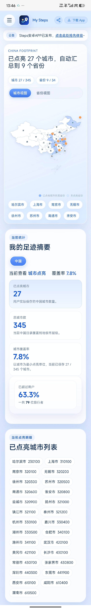
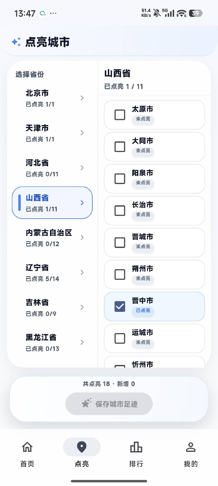
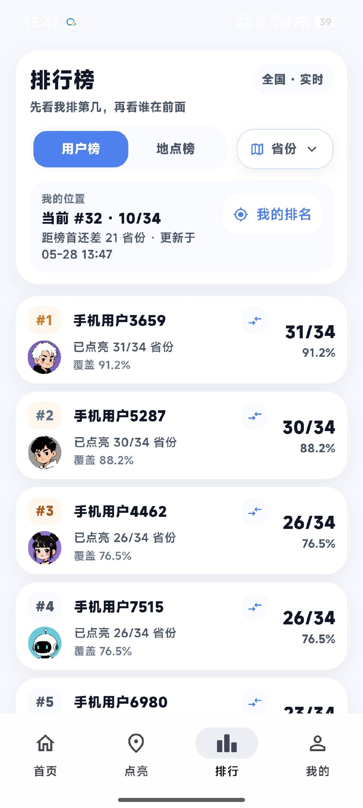
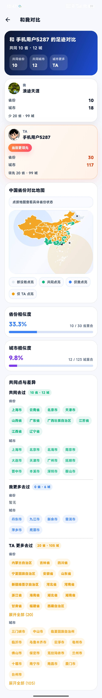
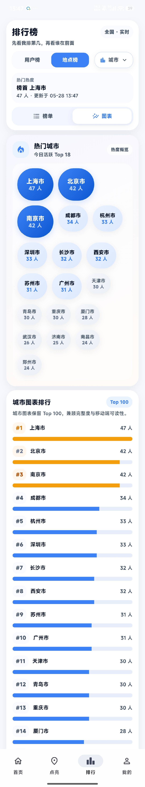
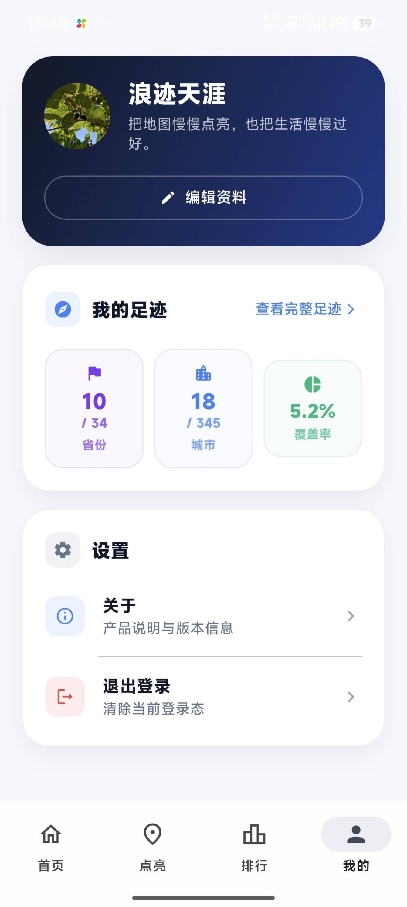
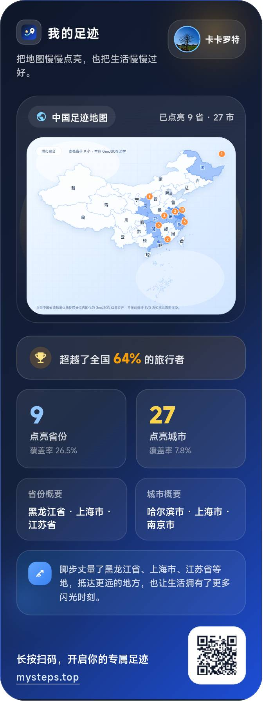

# My Steps：一个可以点亮中国旅行地图的足迹记录网站

## 一句话介绍
**My Steps（mysteps.top）** 是一个主打**旅行足迹记录、地图点亮、城市与省份统计、个人旅行档案沉淀**的网站，适合想把“中国去过哪里”清晰可视化展示出来的用户。

## 链接
- 官网：https://mysteps.top/
- 关于页面：https://mysteps.top/about.html
- Android App：https://fir.xcxwo.com/mysteps

## 适合谁
- 想记录自己去过哪些城市、哪些省份的人
- 喜欢把旅行经历做成可视化地图的人
- 想长期沉淀个人旅行轨迹和旅行数据的人
- 对“旅游足迹地图”“中国旅行地图”“旅行打卡地图”这类产品感兴趣的人

## 为什么值得推荐
- 它不是普通的游记工具，而是围绕 **中国旅行足迹地图** 做得更聚焦
- 可以把去过的**城市**和**省份**直接点亮，形成非常直观的地图反馈
- 首页就能看到已点亮城市数、已覆盖省份数，很适合做旅行进度管理
- 支持登录后继续维护自己的足迹档案，既能浏览，也能逐步积累自己的地图记录
- 已经有独立域名、产品页、协议页和 App 下载入口，整体更像一个持续迭代中的正式产品，而不是临时 demo

## 功能概览
如果你搜索下面这些关键词，这个网站都比较对路：

- **旅行足迹网站**
- **足迹地图网站**
- **中国旅行地图**
- **旅游足迹记录**
- **点亮中国地图**
- **去过的城市地图生成**
- **去过的省份统计**
- **旅行打卡地图**
- **个人旅行地图档案**

从当前页面能直接感知到的能力包括：

1. **中国地图点亮展示**  
   可按城市或省份视图查看自己的旅行覆盖范围。

2. **旅行足迹统计**  
   首页会展示已点亮城市数、已汇总省份数，适合快速了解自己的旅行进度。

3. **登录后保存与继续编辑**  
   未登录用户可以先浏览，真正点亮和保存前再登录，整体门槛相对友好。

4. **产品信息与协议页完善**  
   站点包含关于页、用户协议、隐私政策等页面，信息完整度比很多同类小站更高。

5. **移动端延伸**  
   目前已经提供 Android App 下载入口，说明这个产品不是只有一个静态网页，而是在朝完整的旅行记录工具发展。

## 网站端主要页面

### 1. 首页：点亮中国旅行地图

首页是整个产品最核心的入口，重点就是 **“地图 + 已点亮统计 + 主操作按钮”**。用户一打开就能看到：

- 当前已经点亮了多少个城市
- 已经覆盖了多少个省份
- 当前地图上哪些区域已经被点亮
- 继续去“点亮我的足迹”的主入口

这类设计对 SEO 和产品传播都很有帮助，因为用户很容易理解它是一个 **中国旅行足迹地图网站**，而不是泛泛的旅游社区。

### 2. 中国选择页：按地图选择去过的地方

这个页面更偏“实际操作层”，用户可以继续在地图和列表之间切换，选择自己去过的地区。对于“**去过的城市地图生成**”“**去过的省份统计**”这类需求来说，这就是最核心的使用页面之一。

### 3. 排行榜页：看自己点亮进度与排名

排行榜页强化了产品的可玩性。除了“我去过哪里”，它还把旅行足迹转成了一种更容易传播的结果：

- 城市点亮排行榜
- 用户之间的进度对比
- 旅行覆盖范围的可视化竞争感

这类页面对“旅行打卡地图”“足迹排行榜”类关键词也有帮助。

### 4. 个人主页 / 个人中心：沉淀自己的旅行档案

个人主页能看到用户的地图、点亮数据、个性签名、基础信息等，更像一个持续积累的“**个人旅行地图档案页**”。这也是 My Steps 和普通一次性地图生成工具不太一样的地方：它更偏长期记录，而不是只生成一次结果图。

## App 端主要页面

### 1. App 首页：地图与统计继续收口

移动端首页继续保留了产品核心：地图、统计、点亮入口。说明 My Steps 不只是一个桌面端网页工具，而是正在往更完整的 **旅行记录 App** 方向推进。

### 2. App 排行榜：移动端也保留社交和进度感

移动端排行榜延续了 Web 的玩法，让用户可以随时查看自己的覆盖进度和整体排名。对于喜欢“打卡”“收集”“点亮地图”玩法的人来说，这会增强留存。

### 3. App 个人中心：查看资料与旅行身份感

个人中心页让产品不只是地图工具，还带有明确的“账户体系”和“长期使用”属性。对用户来说，这意味着自己的旅行记录、头像、资料、统计结果，都能逐渐沉淀在同一个系统里。

## 我觉得它特别适合的使用场景

### 1. 想知道自己到底去过中国多少地方
很多人平时会说“我去过很多城市”，但真要统计时很难一眼说清。My Steps 这种**中国足迹地图网站**的价值，就在于它能把“印象”变成“可视化结果”。

### 2. 想做一个长期更新的旅行记录主页
相比散落在相册、朋友圈和笔记里的旅行片段，把去过的城市、去过的省份整理到一张地图里，会更有连续性，也更适合长期维护。

### 3. 想找一个更偏中国旅行场景的地图产品
很多足迹类产品要么偏全球地图，要么偏社交打卡，而 My Steps 当前的方向明显更聚焦在**中国旅行地图**这个场景上，对想记录国内旅行的人更直接。

### 4. 想找“点亮地图”类网站做纪念
如果你本身就喜欢“点亮城市”“点亮省份”“记录我去过哪里”这类玩法，那 mysteps.top 的产品方向会比较对胃口。

## 对 SEO 关键词更友好的理解方式
如果从搜索引擎视角看，My Steps 比较适合覆盖这些中文关键词组合：

- My Steps
- mysteps.top
- 我的足迹网站
- 足迹地图
- 旅行足迹
- 旅游足迹记录
- 中国旅行地图
- 中国地图点亮
- 点亮中国地图网站
- 去过的城市地图
- 去过的省份统计
- 旅行打卡网站
- 旅行轨迹记录网站
- 个人旅行地图
- 旅行足迹 App
- 地图打卡 App

如果后续围绕这些词继续补内容、补页面说明、补文章和站外介绍，理论上会更容易被搜索到。

## 我最喜欢的地方
- 方向很明确：不是泛泛而谈“旅游社区”，而是聚焦**记录和点亮中国旅行足迹**
- 地图展示很直观，这类产品只要地图反馈做得好，就很容易让人愿意继续补数据
- Web 和 App 的核心骨架已经逐步成型，说明它不是只有单页面展示，而是有完整产品路线
- 对于“我去过哪里”这个需求，它给出的答案比纯文字列表更有记忆点

## 不足或注意点
- 当前还属于持续迭代中的产品阶段，功能还可以继续丰富
- 如果后续想拿到更好的搜索流量，除了产品本身，还需要持续做内容页、专题页、SEO 文章和站外引用
- 这类产品很吃“持续记录”和“分享传播”，后面如果能继续强化个人主页、排行榜、旅行总结等能力，传播性会更强

## 类似搜索意图下可关注的方向
- 足迹地图生成工具
- 旅游地图打卡网站
- 中国旅行记录网站
- 个人旅行相册地图
- 去过哪里可视化工具

## 总结
如果你最近正好在找：

- **旅行足迹记录网站**
- **中国地图点亮工具**
- **去过的城市和省份统计网站**
- **个人旅行地图生成工具**
- **旅行足迹 App**

那 **My Steps（https://mysteps.top/）** 值得你实际打开看看。它现在已经具备比较清晰的产品骨架：**可浏览、可登录、可点亮、可统计、可沉淀**，而且路线也很明确，就是围绕“我的中国旅行足迹”持续做深。

从“冷门但有潜力的网站”这个角度看，它属于那种方向很清楚、产品感也已经出来了的项目。

## 标签
`#网站` `#旅行足迹` `#中国旅行地图` `#足迹地图` `#旅游记录`
